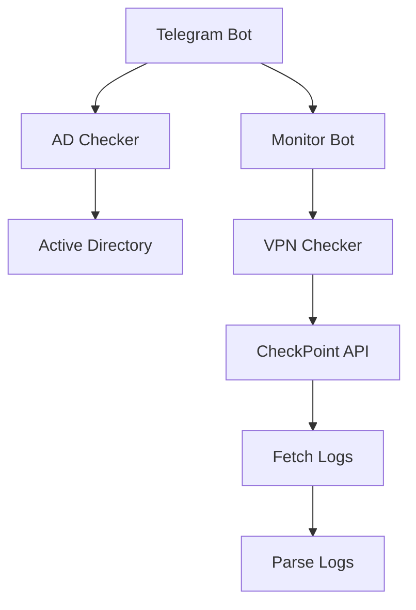

# Telegram бот для мониторинга активности VPN пользователей через CheckPoint API и Active Directory.

## Возможности

- **Автоматический мониторинг** подключений к VPN
- **Алерты только в рабочие дни** (Пн-Пт) в 10:00 и 17:00
- **Умный алерт** — отправляется при 2+ рабочих днях без подключения
- **Суббота и воскресенье не учитываются** в подсчете дней отсутствия
- **Защита от спама** — один алерт в день на пользователя
- **Детальный отчет** по клику на кнопку или команде `name.family`
- **Команда `/list`** — просмотр статуса всех пользователей в мониторинге
- **Часовой пояс Киев (UTC+3)** — корректное время проверок и отчетов
- **Автоочистка** — старые логи удаляются через 7 дней
- **Docker контейнеризация** — легкий запуск и деплой

---

## Команды бота

- **`/start`** — Приветствие и основная информация о боте
- **`/help`** — Справка по использованию и доступным командам
- **`/list`** — Список всех пользователей в мониторинге с их текущим статусом
- **`petr.petrov`** — Выгрузка детального отчета по конкретному пользователю (вместо `petr.petrov` укажите логин пользователя)

---

## Структура проекта

### 🔹 Основные модули

- **`monitor_bot.py`** — Главный бот. Обрабатывает команды Telegram, управляет алертами, расписанием проверок и выгрузкой отчетов.
- **`ad_checker.py`** — Работа с Active Directory. Получает список пользователей из группы `Chk_Alert` и их атрибуты (логин, email, отображаемое имя).
- **`vpn_checker.py`** — Работа с CheckPoint API. Проверяет последний успешный логин пользователя в VPN за последние дни.
- **`fetch_logs.py`** — Сбор логов VPN за последние 30 дней из CheckPoint API. Сохраняет в CSV для дальнейшего анализа.
- **`parse_logs.py`** — Парсинг собранных логов. Преобразует сырые логи в читаемый отчет с хронологией сессий и timeout-событий.

### 🔹 Конфигурация

- **`config.py`** — Конфигурация проекта. Читает переменные окружения из `.env` и содержит настройки (группы AD, часы проверки, порог алерта).
- **`.env`** — Конфиденциальные настройки (не попадает в репозиторий!). Токен бота, Chat ID, учетные данные AD и VPN.

### 🔹 Директории

- **`data/`** — Хранение состояния алертов (`sent_alerts.json`, `last_check.json`). Данные сохраняются между перезапусками.
- **`logs/`** — Временная директория для логов. Файлы удаляются после отправки отчета или через 7 дней.

